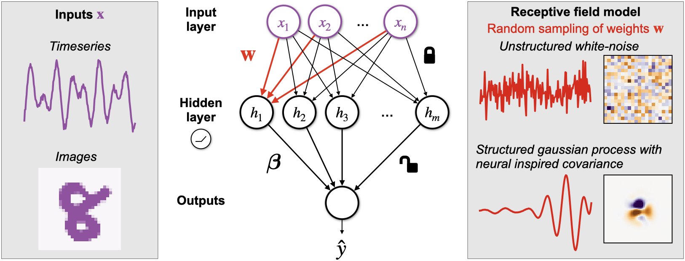

Structured random receptive fields
==============================

This code generates the analyses in the paper "Structured random receptive fields enable informative sensory encodings".
https://www.biorxiv.org/content/10.1101/2021.09.09.459651

__Summary__: In this work, we describe an approach to model receptive fields
of biological neurons as samples from Gaussian Processes (GP).
We successfully model receptive fields datasets in two disparate 
sensory regions, insect mechanosensors and mammalian primary visual cortex (V1).
Using our models, we also show a novel initialization scheme that improves
the learning efficiency of artificial neural networks (ANNs).



Steps to set up the directory:
------------

1. Do a clean download of the repository. Go inside the repo.
	```
        cd \path\to\structured_random_features\
	```
2. Make a virtual Conda environment. We will be using python version 3.8.
	```
	conda create --name random_features python=3.8
	```
3. Activate the new conda environment
	```
	conda activate random_features
	```
4.  Run the make file to download all the datasets and preprocess.
	```
         make data
	 ```
5.  Run the notebooks in *notebooks/reports* folder.  

__Remark__: Always work in the newly created conda environment.


Replicating our published findings
------------
- The source code is in the */src* folder. The jupyter notebooks in */notebooks/reports* 
folder show the analyses used in the paper. 

- Notebooks 1--5 show how we fit our covariance models to biological data. We 
plot these results in Notebooks 16.0--16.4.

- Notebooks 6 and 7 show the results on the time-series classification tasks. We
plot these results in Notebook 16.5.

- Notebooks 8--11 show the results on the digit classification tasks. We plot these
results in Notebook 16.6.

- Notebooks 12--15 show our classification performance when initializing networks 
with structured random features. We plot these results in Notebook 16.7 and 16.8

- Notebooks 16.xx are used to plot the figures shown in the paper. They
assume that you have run the relevant notebooks and saved the results. 


__Remark__: This project structure is based on the <a target="_blank" href="https://drivendata.github.io/cookiecutter-data-science/">cookiecutter data science project template</a>.
